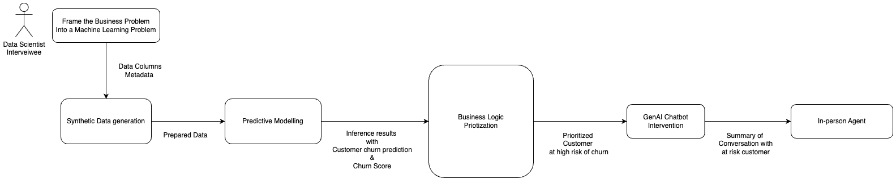
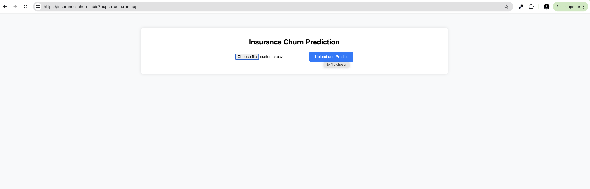
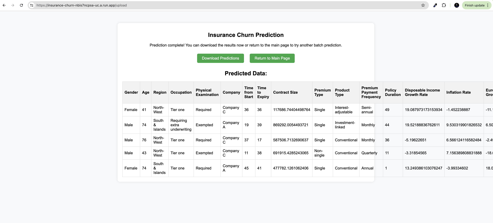
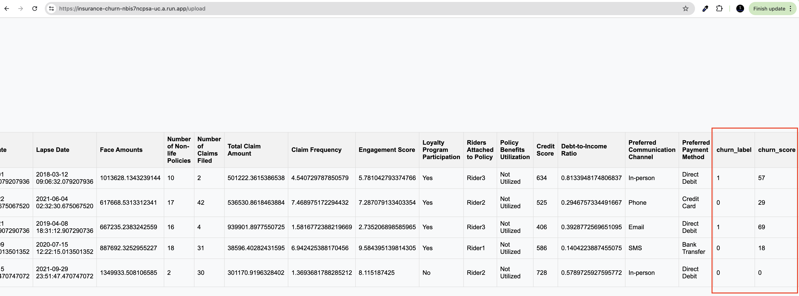

# Insurance Churn Prediction Model

## Problem Statement.

In this exercise, you are required to showcase your knowledge and skills in applying AI/ML
techniques to help Prudential gain a competitive edge. Given that real-world data can be scarce and
sometimes inaccessible to Data Scientists, and yet you need to demonstrate AI/ML can bring value
to business in a responsible way. To overcome this challenge, you have decided to use a "synthetic
data" approach to illustrate how your solution can be applied by first generating the data yourself.

- Implement an early lapse prediction model to improve customer retention and churn rate by
  triggering prompts/agent follow-up.

Given a short problem statement engage in a meaningful understanding to scope the problem and use it to convert business problem into a machine learning and Gen AI problem is the key.

## Clarifying requirements and Methodology adopted.

### Clarifying requirements

Let's begin by understanding the scope of the problem more clearly.

Customer Journey: Can you describe the typical customer journey and at what points you believe customers are at risk of lapsing?
Data Availability: Although we will be using synthetic data, understanding the types of data usually available (customer demographics, transaction history, engagement metrics) will help us generate realistic synthetic data.
Business Goals: What are the primary business metrics we're aiming to improve? Is it reducing churn rate by a certain percentage, increasing customer lifetime value, or something else?
Intervention Mechanisms: What are the current intervention methods? Are we using email prompts, push notifications, direct agent calls, or a combination of these?
Timeliness: How early do we need to predict the lapse for the intervention to be effective? Are there specific time frames or critical points in the customer lifecycle?
Success Metrics: How do we measure the success of the interventions? Are we tracking re-engagement rates, changes in customer behavior, or other metrics?

### Methodology

With these details in mind, let's break down the problem into a machine learning and generative AI problem:

Data Collection and Preprocessing:

- Synthetic Data Generation: Since real-world data is scarce, we'll generate synthetic data that mimics real customer data. This includes customer demographics, transaction history, engagement metrics, and support interactions.
- Feature Engineering: Create features that capture customer behavior and interaction patterns. This could include features like recency, frequency, and monetary value (RFM), engagement scores, and sentiment analysis from support interactions.
- Labeling: Define what constitutes a "lapsed" customer. This could be based on inactivity for a certain period, a drop in engagement metrics, or cancellation of services.

- Predictive Modeling:

  - Model Selection: Choose appropriate machine learning models for predicting lapse. This could involve classification models like logistic regression, random forests, gradient boosting machines, or neural networks.
  - Training and Validation: Split the synthetic data into training and validation sets, and train the models to predict the probability of a customer lapsing. Evaluate the models using metrics like precision, recall, F1-score, and ROC-AUC.

- Intervention Strategy:

  - Trigger Mechanisms: Develop a system to trigger interventions based on the model's predictions. This could be automated chatbot prompts, email propmts, push notifications, or tasks assigned to customer service agents.
  - Personalization: Use generative AI models to create personalized messages for each customer. This could involve generating email content, push notification text, or call scripts that are tailored to the customer's behavior and preferences.

- Monitoring and Feedback Loop:
  - Real-time Monitoring: Implement a system to monitor customer activity and model predictions in real-time. This allows for timely interventions.
  - Feedback Loop: Continuously collect data on the effectiveness of the interventions. Use this data to retrain and improve the model, ensuring it adapts to changing customer behavior over time.

This Repository holds code for the part first part where I take care of Predictive Modelling for System to generate prediction for Customers at high churn risk.
Out of this model would be passed through business logic to prioritize and enagage customer at risk in conversation by automated GenAI chatbot to understand and try to resolve the customers issue.



## Introduction

This project aims to develop a machine learning model to predict insurance policy lapses and reduce churn rates. The solution involves creating a comprehensive data processing pipeline, training multiple models, and setting up a batch inference system. The entire application is containerized using Docker, ensuring easy deployment and execution in any environment.

## Methodology

### 1. Data Collection

The dataset includes various features related to insurance policies, such as customer demographics, policy details, and historical interactions. The data is split into training and test sets to evaluate the model's performance.

### 2. Data Preprocessing

Data preprocessing involves several steps to clean and prepare the data for modeling:

- **Data Cleaning**: Removing or imputing invalid data entries.
- **Handling Missing Values**: Imputing missing values using appropriate techniques.
- **Handling Outliers**: Identifying and handling outliers to ensure they do not adversely affect model performance.
- **Feature Generation**: Creating new features from existing ones to enhance model performance.

### 3. Model Training

Multiple models are trained and evaluated to identify the best-performing model for predicting churn:

- **Logistic Regression**: A simple yet effective linear model for binary classification.
- **Random Forest**: An ensemble model that uses multiple decision trees to improve performance.
- **XGBoost**: A powerful gradient boosting algorithm that provides superior performance for many classification tasks.

### 4. Model Evaluation

Models are evaluated using various metrics such as F1-score, recall, precision, AUC score, and confusion matrix to ensure their effectiveness in predicting churn.

### 5. Batch Inference

A batch inference pipeline is set up to process new data, generate predictions, and save the results. This allows for efficient and scalable prediction of churn for large datasets.

## Folder Structure

```
project/
│
├── Dockerfile
├── Makefile
├── README.md
├── app.py
├── batch_inference.py
├── data
│   ├── processed.csv
│   └── raw.csv
├── data_preprocessing.py
├── model_training.py
├── models
├── notebooks
├── requirements.txt
├── run.py
├── runner
│   ├── inference.py
│   └── train_model.py
└── src
    ├── data_cleaning.py
    ├── feature_generation.py
    ├── handling_missing_values.py
    ├── handling_outliers.py
    └── models_training
        ├── logistic_regression.py
        ├── random_forest.py
        └── xgboost_model.py
```

## Detailed Components

### Data Preprocessing

The `src` directory contains various preprocessing scripts:

- **`data_cleaning.py`**: Functions for cleaning the dataset.
- **`feature_generation.py`**: Functions for generating new features.
- **`handling_missing_values.py`**: Functions for handling missing values.
- **`handling_outliers.py`**: Functions for handling outliers.

### Model Training

The `models_training` directory contains scripts for training different models:

- **`logistic_regression.py`**: Training and evaluation of logistic regression model.
- **`random_forest.py`**: Training and evaluation of random forest model.
- **`xgboost_model.py`**: Training and evaluation of XGBoost model.

### Runner Scripts

The `runner` directory contains scripts to run training and inference processes:

- **`train_model.py`**: Orchestrates model training.
- **`inference.py`**: Handles batch inference process.

### Flask Application

The `app.py` file sets up a Flask web application to provide a user interface for uploading files and downloading predictions.

### Dockerfile

The Dockerfile sets up the environment to run the Flask application in a container.

```Dockerfile
# Use the official lightweight Python image.
FROM python:3.10-slim

# Set environment variables
ENV PYTHONUNBUFFERED=1

# Set the working directory
WORKDIR /app

# Create a non-root user and switch to it
RUN adduser --disabled-password --gecos '' appuser && chown -R appuser /app
USER appuser

# Copy the requirements file into the container
COPY --chown=appuser:appuser requirements.txt /app/requirements.txt

# Install the dependencies
RUN pip install --no-cache-dir -r requirements.txt

# Copy the entire application code into the container
COPY --chown=appuser:appuser . /app

# Expose the port the app runs on
EXPOSE 5000

# Set the entry point to run the Flask application
ENTRYPOINT ["python", "app.py"]
```

## Running the Project

### Prerequisites

Ensure you have the following installed on your system:

- Docker
- Python 3.10
- Pip

## Deployed Demostration

Solution is deployed on GCP using contanizered Image of the code here.

https://insurance-churn-nbis7ncpsa-uc.a.run.app/

### Demo

- Step 1 : Upload your file need to run prediction. Click Upload and predict. [provided under data folder]
  

- Step 2 : Click on download to get prediction with churn label and churn score.
  

- Step 3 : You can see score on the page as well scroll to right to see churn score and churn label
  

Next Repo will Implement the Intevention menthod using GenAI chatbot, after passing through business logic which I have left at viewer discretion.

By following these steps, you can deploy and use the insurance churn prediction model efficiently. The detailed methodology and organized folder structure ensure that the project is easy to understand and extend. If you have any questions or need further assistance, please feel free to reach out.
